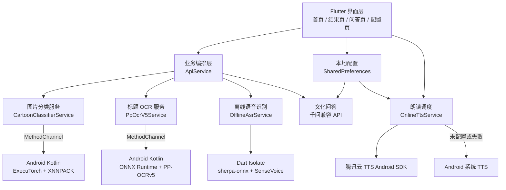

# 民族文化识别助手

一款面向民族文化学习场景的 Android Flutter 应用。应用可通过相机或相册识别民族服饰卡通人物，展示对应的文化资料，并提供文字问答、离线语音输入和语音朗读能力。

当前图片分类、OCR 和语音识别均在设备本地完成；文化问答使用千问兼容接口；回答朗读优先使用腾讯云 TTS，失败或未配置时自动回退到 Android 系统 TTS。

> 本项目只用于识别民族服饰卡通图片中的文化元素，不根据真人面部、肤色或外貌判断民族身份。

## 功能概览

- 相机拍照与相册选图。
- 本地 56 类民族服饰卡通分类，最高置信度低于 70% 时不展示识别结论。
- PP-OCRv5 本地标题识别，作为分类结果的辅助信息。
- 基于 `culture_info.json` 展示服饰特征、地区、节日和历史资料。
- 使用千问 OpenAI-compatible API 进行文化问答。
- 使用 sherpa-onnx + SenseVoice INT8 进行完全离线的语音转文字。
- 使用腾讯云在线 TTS 朗读回答，并在失败时回退系统 TTS。
- 模型和密钥配置保存在设备本地，不通过 `dart-define` 将 API 密钥打包进 APK。

## 总体架构



## 分层说明

| 层级 | 主要职责 | 关键实现 |
| --- | --- | --- |
| 界面层 | 拍照、选图、结果展示、问答、配置 | `lib/pages/`、`lib/widgets/` |
| 业务编排层 | 并行调度 OCR 与分类、70% 门限、文化资料组装、问答上下文 | `lib/services/api_service.dart` |
| Flutter 服务层 | 图片预处理、离线 ASR、TTS 调度、配置持久化 | `lib/services/` |
| Android 原生层 | ExecuTorch 推理、PP-OCRv5 推理、腾讯云 TTS 播放 | `android/app/src/main/kotlin/` |
| 数据与模型层 | 56 类标签、文化资料、服饰图片、OCR/ASR/分类模型 | `app_flutter/assets/` |
| 云服务层 | 千问文化问答、腾讯云语音合成 | 运行时配置，不在仓库保存密钥 |

## 核心链路

### 1. 图片识别

```text
相机 / 相册图片
  -> 修正 EXIF 方向
  -> 等比例缩放，短边变为 256
  -> 中心裁剪 224 x 224
  -> RGB / 255
  -> ImageNet mean/std 标准化
  -> NCHW float32 [1, 3, 224, 224]
  -> Flutter MethodChannel
  -> Android ExecuTorch 1.3.1 / XNNPACK
  -> ResNeSt50 INT8 QAT 输出 56 类 logits
  -> Flutter softmax
  -> 最高置信度达到 70% 后展示文化资料
```

分类与 OCR 相互独立，并行执行以缩短等待时间。最终民族类别由 ResNeSt50 分类结果决定；PP-OCRv5 会从左上区域、上半区和整图搜索民族标题，仅作为辅助信息和排查依据。

应用首次加载分类模型时，会将约 25 MiB 的 `.pte` 文件从 Flutter assets 复制到应用私有目录，之后使用 MMAP 方式复用，避免每次推理重复复制和额外的大块内存分配。

### 2. 语音问答

```text
用户录音（16 kHz）
  -> 静音检测 / 自动停止
  -> SenseVoice INT8 离线识别
  -> 文字问题 + 当前识别结果
  -> 千问兼容 Chat Completions API
  -> 中文文化讲解
```

SenseVoice 模型运行在长期驻留的 Dart Isolate 中，减少大模型反复加载造成的卡顿。录音和转写内容不会发送到在线 ASR 服务。

### 3. 语音朗读

```text
问答文本
  -> 检查腾讯云 TTS 配置
  -> 腾讯云 Android SDK 在线合成并播放
  -> 合成或播放失败时回退 Android 系统 TTS
```

只有界面提示“正在使用大模型 TTS 朗读回答”时，才表示腾讯云链路已成功开始播放；“正在使用系统 TTS”表示没有使用腾讯云调用量。

## 在线与离线边界

| 功能 | 是否需要网络 | 说明 |
| --- | --- | --- |
| 民族服饰卡通分类 | 否 | ResNeSt50 + ExecuTorch 本地推理 |
| 图片标题 OCR | 否 | PP-OCRv5 + ONNX Runtime 本地推理 |
| 语音转文字 | 否 | SenseVoice + sherpa-onnx 本地推理 |
| 文化资料展示 | 否 | 读取本地 JSON 和图片资源 |
| 文化问答 | 是 | 调用配置的千问兼容 API |
| 腾讯云语音朗读 | 是 | 未配置或失败时回退系统 TTS |

## 技术栈

| 模块 | 技术 |
| --- | --- |
| 客户端 | Flutter / Dart / Material 3 |
| Android 原生 | Kotlin / Java 17 / MethodChannel |
| 图片分类 | ResNeSt50d、PT2E INT8 QAT、ExecuTorch 1.3.1、XNNPACK |
| OCR | PP-OCRv5 mobile detection + recognition、ONNX Runtime 1.24.3 |
| 离线 ASR | sherpa-onnx 1.13.3、SenseVoice INT8 |
| 在线问答 | 千问 OpenAI-compatible Chat Completions API |
| 在线 TTS | 腾讯云 TTS Android SDK v2.x |
| 本地配置 | shared_preferences |

## 目录结构

```text
ethnic_culture_app/
├─ app_flutter/                 Flutter Android 应用
│  ├─ lib/
│  │  ├─ pages/                 首页、结果、问答、配置页面
│  │  ├─ services/              分类、OCR、ASR、问答、TTS 与配置服务
│  │  └─ widgets/               结果卡片等复用组件
│  ├─ android/app/src/main/kotlin/
│  │  └─ com/example/app_flutter/
│  │     ├─ ExecuTorchClassifierChannel.kt
│  │     ├─ PpOcrV5Channel.kt
│  │     ├─ TencentTtsChannel.kt
│  │     └─ MainActivity.kt
│  ├─ assets/
│  │  ├─ model/                 ResNeSt50 模型、标签和元数据
│  │  ├─ ocr/ppocrv5/           OCR 模型与字典
│  │  ├─ asr/sensevoice/        ASR 模型目录
│  │  ├─ costumes/              民族服饰展示图片
│  │  ├─ totems/                图腾展示图片
│  │  └─ culture_info.json      文化资料
│  ├─ test/                     Flutter 单元与组件测试
│  └─ tool/                     模型下载和资源生成脚本
├─ culture_photos/              文化图片素材
├─ docs/                        运行与维护文档
└─ README.md                    项目总览
```

## 环境准备

- Flutter 3.x 稳定版。
- Android SDK 与可用的 Android 真机或模拟器。
- JDK 17。
- Windows PowerShell（模型下载脚本使用）。

先检查开发环境：

```powershell
flutter doctor
```

## 本地运行

```powershell
cd app_flutter
flutter pub get
powershell -ExecutionPolicy Bypass -File .\tool\download_sensevoice_model.ps1
flutter run
```

SenseVoice INT8 ONNX 模型约 228 MiB，超过 GitHub 普通单文件限制，因此不提交到仓库。下载脚本会校验文件大小和 SHA-256；本地构建 APK 时会把模型打包到应用中。

## 运行时配置

首页顶部区域在 3 秒内连续点击 5 次，输入开发配置密码 `123456`，可进入设备本地配置页。

可配置内容包括：

- 千问 API Base URL、API Key、聊天模型。
- 腾讯云 AppID、SecretId、SecretKey、STS Token、VoiceType。

千问接口地址和模型名可通过 `dart-define` 提供默认值，但 API Key 和腾讯云长期密钥不会从 `dart-define` 写入 APK：

```powershell
flutter run --dart-define=QWEN_BASE_URL=https://dashscope.aliyuncs.com/compatible-mode/v1 --dart-define=QWEN_CHAT_MODEL=qwen-turbo
```

> 不要把 `.csv`、SecretKey、`.env`、签名文件或其他凭据提交到 Git。面向正式用户发布时，建议使用服务端签名或 STS 临时凭证，避免在客户端长期保存固定密钥。

## 构建发布版

```powershell
cd app_flutter
powershell -ExecutionPolicy Bypass -File .\tool\download_sensevoice_model.ps1
flutter build apk --release --target-platform android-arm,android-arm64 --split-per-abi
```

当前 `release` 构建仍使用 debug 签名，正式发布前应配置独立的 Android release keystore。

## 校验

```powershell
cd app_flutter
flutter analyze
flutter test
```

重点真机回归项：

- 连续拍照、确认和返回操作是否稳定。
- 首次模型加载、第二次识别耗时和内存变化。
- 门巴族/彝族、水族/汉族等历史混淆样本。
- 无网状态下图片分类、OCR 和语音识别。
- 腾讯云 TTS 成功、失败及系统 TTS 回退状态。
- 长时间运行后的内存、温升和音频资源释放。

## 模型信息

| 项目 | ResNeSt50 分类模型 |
| --- | --- |
| 文件 | `app_flutter/assets/model/resnest50_ethnic_int8_qat.pte` |
| 后端 | ExecuTorch + XNNPACK |
| 量化 | PT2E INT8 QAT，权重按通道对称量化 |
| 输入 | `float32 [1, 3, 224, 224]`，NCHW、RGB |
| 输出 | `[1, 56]` 未归一化 logits |
| 文件大小 | 26,163,296 字节 |
| SHA-256 | `7936076795ab0c6eb1ab6fd2462a02b94d9357baf5095dbdc36749c5826d44c4` |

更详细的图片识别实现说明见 [`app_flutter/README.md`](app_flutter/README.md)，运行维护说明见 [`docs/`](docs/)。
